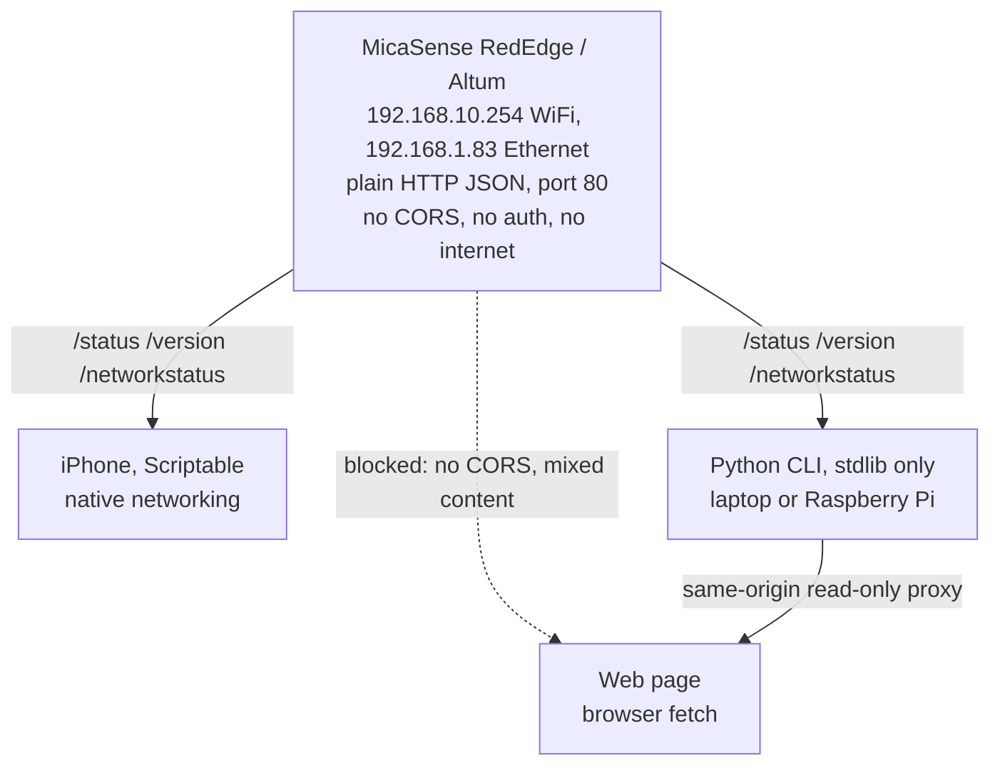
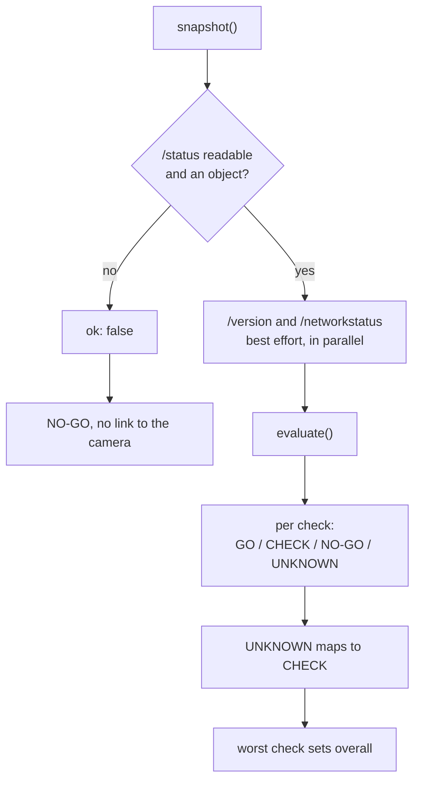

# RedEdge Readiness, Architecture

Design notes for a preflight readiness tool for the MicaSense RedEdge and Altum multispectral cameras. It answers one question for a survey pilot standing at the launch site, under time pressure, with gloves on:

**Is this sensor ready to capture good data, right now, and why?**

This document covers the architecture and the reasoning behind it. For what the tools are and how to install them, see [README.md](README.md). For the day-to-day field flow, see [OPERATING.md](OPERATING.md). A hosted demo of the interface is at <a href="https://rededge-api.write2ayushjha.workers.dev/" target="_blank" rel="noopener noreferrer">rededge-api.write2ayushjha.workers.dev</a> (demo states only, see [Deployment](#deployment)).

---

## The constraint that shapes everything

The camera is a local device. It serves plain HTTP JSON at `192.168.10.254` over its own WiFi access point (or `192.168.1.83` over Ethernet), on port 80, with no internet, no authentication, and no CORS headers.

Three consequences fall out of that single fact, and they drive the whole design:

1. **A browser cannot read the camera.** Without CORS headers, a cross-origin read is blocked. From an HTTPS page it is blocked twice over, because loading a plain-HTTP resource from a secure page is mixed content.
2. **There is no cloud.** No internet is available at the camera. Anything that depends on a server, an API key, or a package registry at runtime is useless in the field.
3. **The client must be native, or same-origin.** That means an iPhone app with native networking, a local process, or a same-origin proxy.

This is why the tool is not one app. It is three clients over one shared evaluation contract.

---

## Safety model: fail toward caution

The tool exists to prevent a wasted flight, and a wrong answer is worse than no answer. A false "all clear" is the only truly unacceptable output, so the design makes one structurally hard to produce.

The whole model is four characters wide, in `rededge.py`:

```python
RANK = {"GO": 1, "CHECK": 2, "UNKNOWN": 2, "NO-GO": 3}
```

`UNKNOWN` sits in the same table as the real answers, ranked identically to `CHECK`. It is not `None`, not an exception, not a missing key. A reading you could not take is a reason to look, not a reason to relax.

That placement is the point. A value that exists in the rank table cannot be quietly dropped by code that forgot to handle it, because every consumer that reads a state has to deal with `UNKNOWN` to compile at all. Discipline does not survive a refactor. Types do.

The rest follows from it:

- **Anything unconfirmable reads CHECK.** Internally a check can be `UNKNOWN`; `UNKNOWN` is mapped to `CHECK` before the overall state is computed. There is no path where missing data becomes a pass.
- **A lost link reads NO-GO.** If the camera does not answer, or answers with something that is not an object, the readout is NO-GO, not a stale pass.
- **The worst check sets the overall state.** One blocking check is enough to produce NO-GO regardless of what else is green.
- **An unrecognized status is not a pass.** If the SD or DLS status is a value the tool does not recognize, it reads `UNKNOWN` (so, CHECK). It does not fall through to GO.

The aggregation has no averaging and no weighting:

```python
def _worst(states):
    out = "GO"
    for s in states:
        if RANK[s] > RANK[out]:
            out = s
    return out
```

Six checks green and one unknown is not GO. A score would imply the checks are commensurable, that good GPS can offset a missing DLS reading. They are not and it cannot.

The tradeoff is deliberate: the tool prefers to be over-cautious against a real camera rather than optimistic against an incomplete read.

---

## Not every unknown is a hard stop

Unknown link is `NO-GO`. Unknown firmware version is `CHECK`. Unknown card status is `CHECK`. Unknown DLS is `CHECK`, or `NO-GO` if the DLS reports an actual error.

That is a calibration, and it is the part most likely to be wrong.

The rule underneath it: an unknown a crew can resolve on the spot is a `CHECK`, because they can walk over and look. An unknown that means the tool cannot see the camera at all is `NO-GO`, because there is nothing to resolve and no basis for any verdict. A tool with no link is not reporting on a camera. It is reporting on itself.

Thresholds live in `rededge.json` for exactly this reason. If a crew disagrees with a calibration, they should change it rather than work around it.

---

## Topology



The dotted edge is the important one. The web client cannot reach the camera directly, which is a property of the platform, not a bug to fix. It is why the hosted page is honest about being a demo, and why live web reads only work through the local proxy.

---

## Three clients, one contract

| Client | Runtime | Role |
| --- | --- | --- |
| iPhone (Scriptable) | Native iOS networking | The everyday field tool. No CORS restriction, no server, no internet. Home Screen icon, widget, on-device settings. |
| Python CLI | Python stdlib only, no dependencies | Offload, capture, verification, and a local proxy. Runs on a laptop or a Pi joined to the camera WiFi. |
| Web page | Browser | Demo, review, and training on any device. Live use requires the local proxy. |

Each client is a full implementation of the same readiness logic, in its own language, because there is no shared runtime across a Scriptable script, a browser page, and a Python process, and adding a build step to unify them would buy less than it costs.

The risk of three implementations is drift. That is managed by treating the evaluation as a **contract** rather than three independent features:

- Identical thresholds and config schema across all three.
- Identical demo fixtures, so the same scenario produces the same state everywhere.
- A parity harness that loads the web and iOS evaluators side by side and asserts they agree on every canonical scenario.
- A Python test suite that cross-checks the same scenarios and the same states.

---

## Zero dependencies, on purpose

`rededge.py` imports only the standard library: `argparse`, `json`, `os`, `socket`, `sys`, `time`, `urllib`, `http.server`. No requests, no click, no rich.

This runs on a field laptop or a Raspberry Pi joined to the camera's WiFi, which means no internet, which means `pip install` may not be available at the moment it is needed. A dependency that cannot be installed in the field is not a dependency. It is a failure mode.

The tradeoff is more code. `urllib` is clumsier than `requests` and the ANSI color handling is hand-rolled, a few hundred lines a dependency would have absorbed. In exchange, `python3 rededge.py check` runs on any machine with Python 3 and nothing else, which is the only property that matters at a launch site.

The CLI exits `0` for GO, `1` for CHECK, `2` for NO-GO, so it composes with shell scripts and cron without parsing output.

---

## The evaluation pipeline



`/status` is the one critical read. The other two are best-effort by design: a flaky `/version` degrades the firmware check to CHECK rather than collapsing the whole readout to a false no-link NO-GO. This distinction matters in the field, where a partial answer is common and a pilot still needs the rest of the picture.

Note the split at step G and H. Each individual check reports `UNKNOWN` when that is the truth, and the overall verdict folds `UNKNOWN` into `CHECK`. The two lines answer different questions. The summary answers "can I fly?", where the only useful answers are go, look, or stop. The detail answers "what specifically is wrong?", where the difference between *the DLS reported an error* and *the DLS reported nothing* is the difference between two different next actions.

---

## Readiness checks

Eight automated checks, read from the camera and evaluated against configurable thresholds. The worst one sets the overall state.

| Check | Default threshold | Reads |
| --- | --- | --- |
| SD storage | 2 GB free | Card present, writable, headroom |
| GPS fix | 6 satellites | Usable fix for geotagging |
| Position accuracy | 5 m | Reported accuracy (1 sigma) |
| Light sensor (DLS) | Present and Ok | Irradiance sensor state |
| Supply voltage | 4.2 V | Bus voltage |
| Time source | Valid UTC | Clock source and validity |
| Camera rig | Any (configurable) | Cameras online, DLS present |
| Firmware | Any (configurable) | Version, matched across the rig |

Defaults are sensible starting points, not vendor specification. The minimum supply voltage in particular is a placeholder that should be set against a specific power setup before it is trusted.

Beyond the automated reads, both interfaces carry a manual **pre-flight prep checklist** for the things a camera cannot report about itself: reflectance panel captured, lenses and DLS clean, mount secure, capture interval set, GPS lock.

---

## Robustness

Real cameras return partial and malformed responses, not just clean JSON or nothing. The parsing is built for that, and the behavior is regression-tested by feeding each implementation deliberately broken payloads:

- Wrong types where an object is expected, nulls, lists, junk strings.
- Missing fields, partial payloads, unrecognized status values.
- Failures of individual secondary endpoints.

The invariants under test are: **never crash**, and **never produce a false GO**. Writing these tests found a real crash, where a non-object `network` payload hit a `.get()` call, which is the argument for the tests existing.

---

## Security posture

The honest summary is that the camera itself is unauthenticated and unencrypted on an open network. That is a property of the hardware and is not fixable in client code. The tool is built to not make it worse.

- **No injection surface from camera data.** Every camera-derived string reaches the interface as text, not markup, on both the web and iOS clients.
- **Strict headers on the hosted page.** A Content Security Policy plus `nosniff`, `DENY` framing, `no-referrer`, a restrictive permissions policy, and HSTS.
- **The local proxy is read-only.** GET only, with a fixed target host and an endpoint allowlist. It cannot be turned into an open proxy or an SSRF vector.
- **No secrets to leak.** There is no auth, no API key, and no cloud service in the runtime path.

---

## Testing

No hardware is required to test any of it.

- **A mock camera** (`rededge_mock.py`), serving the same endpoints, with a scenario per readiness state (nominal, low storage, weak fix, warming up, no card, DLS error, dead link, and more).
- **A stdlib unittest suite** (`test_rededge.py`), covering the shared readiness logic, robustness against malformed payloads, config precedence, and the offload walk.
- **A cross-client parity harness**, asserting the web and iOS evaluators agree.
- **CI on every push and pull request**, compiling and running the suite.

The mock earns its place by making failure states reachable. A full SD card, a DLS error, a malformed payload, and a dead link are trivial to produce in the mock and nearly impossible to produce on demand with real hardware. The failure paths matter most here, and real hardware is worst at demonstrating them. It is also what keeps the test suite from carrying a five-figure precondition, which in practice is what stops a test suite from being run at all.

The test names are the invariants:

```
test_malformed_does_not_crash_and_never_false_go
test_unrecognized_status_is_not_go
test_missing_version_degrades_to_check_not_nogo
test_no_link_is_nogo
test_snapshot_tolerates_secondary_endpoint_failure
```

Each asserts something that must stay true, not something the code currently happens to do. A test named `test_evaluate_returns_dict` passes forever and protects nothing. A test named `never_false_go` fails the day someone optimizes the safety property away, which is the only day a test earns its keep.

The deliberate gap: none of this proves correctness against real hardware. The mock encodes assumptions about what the camera reports, and until a physical camera has been read, those assumptions are unverified. It is a model of the camera, not the camera. The design accounts for this by failing toward caution when a real camera returns something unmodeled.

---

## Deployment

The web interface deploys as a Cloudflare Worker serving static assets. There is no server-side application: the page is self-contained, with no build step and no runtime dependencies.

The hosted page is **demo only, by design**. It cannot read a real camera, for the CORS and mixed-content reasons above, and it says so rather than pretending otherwise. When a live read fails on the hosted page, the interface explains that the browser is the limitation and points to the iPhone tool or a local run, instead of offering advice that cannot work.

Demo readouts are marked unmistakably. Even a demo GO carries a DEMO badge, a dashed indicator, and a "simulated data" stamp, so a demo can never be mistaken for a live pass at a glance. A tool whose entire premise is "never show a false all-clear" would be undermined by a demo that looks exactly like a real one.

---

## Scope boundary

This tool covers **sensor readiness only**. Airspace, LAANC, and TFRs are deliberately out of scope, and both interfaces link out to <a href="https://uas-skycheck.app" target="_blank" rel="noopener noreferrer">UAS SkyCheck</a> for flight legality.

That is a product decision, not a gap. Sensor readiness and flight legality are different questions for different moments, and answering both in one tool would dilute a tool whose value is that it answers one question fast and honestly. A crew that reads GO as "cleared to fly" rather than "the sensor is ready" has been misled by the tool, whatever the fine print says.

---

## The rule underneath all of it

The tools never return a clear pass on missing data.

Everything above is that sentence, enforced somewhere different each time: in the rank table, in the aggregation, in the calibration, in the parity harness, in the test names, in the demo badge. Any one of them could be worked around. All of them together are hard to defeat by accident, which is the only kind of defeat that actually happens.
