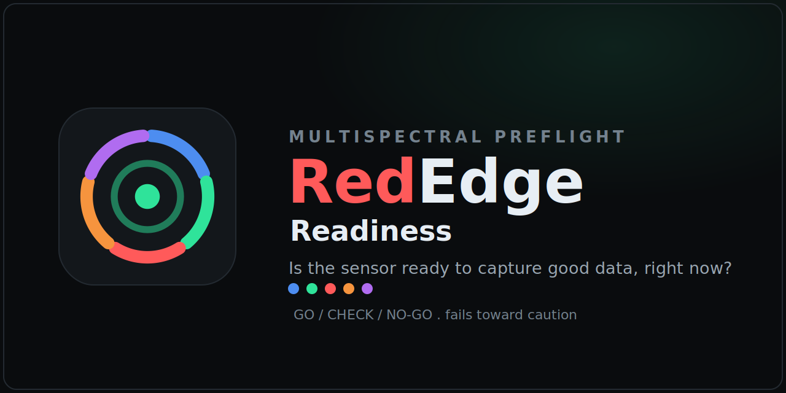

<p align="center">
  
</p>

# RedEdge Readiness

Field readiness and capture tooling for the MicaSense RedEdge and Altum
multispectral cameras, built around one question a pilot needs answered before
launch: is this sensor ready to capture good data, right now, and why.

Every check fails toward caution. Anything that cannot be confirmed reads as
CHECK, a lost link reads as NO-GO, and the tools never return a clear pass on
missing data. They report sensor readiness, not flight legality.

**Live:** [rededge-api.write2ayushjha.workers.dev](https://rededge-api.write2ayushjha.workers.dev/)
The hosted page is for demo, review, and training. It cannot read a real camera,
since a browser on HTTPS cannot reach the camera's local plain-HTTP endpoint
(mixed content) and the camera sends no CORS headers. Live reads come from the
iPhone script or the Python tool. Append `?source=demo-go` (or any demo state)
and `&theme=light` to share a specific preview.

## In the field

The day-to-day flow, start to finish:

1. **Join the camera WiFi.** Every tool that reads the camera must be on its network.
2. **Pre-flight readiness.** On the iPhone, tap the Home Screen icon or run Check now; on a computer, `python3 rededge.py check`. Resolve anything that reads CHECK or NO-GO before flying.
3. **Pre-flight prep.** Work the manual Pre-flight prep checklist in the app: reflectance panel captured, lenses and DLS clean, mount secure, firmware matched, capture interval set, GPS lock. For airspace, LAANC, and TFRs, check [UAS SkyCheck](https://uas-skycheck.app); this tool does not cover flight legality.
4. **Fly.**
5. **Post-flight.** Confirm captures landed with `verify` (or Post-flight check on the phone), then `offload` the imagery.

[OPERATING.md](OPERATING.md) has the one-page version to keep on hand.

## The constraint that shapes everything

The camera is a local device. It serves plain HTTP JSON at `192.168.10.254`
over its own WiFi access point (or `192.168.1.83` over Ethernet), on port 80,
with no internet and no CORS headers.

Two consequences:

- A web page in any phone browser is blocked by CORS from reading the camera's
  JSON, no matter where the page is hosted. A cloud-hosted page can show the UI
  anywhere but can never talk to the camera in the field.
- Anything that reads the camera must run on a device joined to the camera WiFi.
  Native code (Python, or Scriptable on iOS) has no CORS restriction; a browser
  does.

That is why the everyday field tool is the native iOS script, not a website.

## Files

| Path | What it is |
| --- | --- |
| `ios/rededge-readiness.scriptable.js` | iPhone field tool. Paste into the Scriptable app. Native camera read, full-screen readout, Home Screen widget, on-device settings. This is the everyday tool. |
| `rededge.py` | Zero-dependency Python client and CLI for a computer or Pi joined to the camera WiFi: `check`, `watch`, `status`, `offload`, `verify`, `capture`, `serve`, `init-config`. |
| `rededge_mock.py` | Zero-dependency mock camera for testing the tools end to end without hardware. |
| `test_rededge.py` | Stdlib unittest suite: shared readiness logic, robustness against malformed payloads, and the offload walk. Run with `python3 -m unittest test_rededge`. Runs in CI. |
| `web/rededge-readiness.html` | Responsive web version. Demo and review on any device. Live use needs the local proxy in `rededge.py serve`, so it is a computer tool. |
| `web/_headers` | Security headers (Content-Security-Policy and more) applied to the hosted page on Cloudflare. |
| `rededge.example.json` | Template for the shared config schema. Copy to `rededge.json` and edit. |
| `OPERATING.md` | One-page operating guide: the day-to-day pre-flight and post-flight flow. |
| `.gitignore` | Keeps Python artifacts and offloaded imagery out of the repo. |

## iPhone (everyday use)

1. Install Scriptable from the App Store (free).
2. New script, paste in `ios/rededge-readiness.scriptable.js`, name it
   `RedEdgeReadiness` (no spaces keeps the automation URLs below clean).
3. Join the camera WiFi. On first run, allow Local Network access when prompted
   (or enable it in Settings > Scriptable > Local Network).
4. Run from a Home Screen icon or a widget for an instant readout. Re-run to
   refresh.

Open the script inside the Scriptable app to get a menu with Check now,
Post-flight check, Settings, and a Demos submenu of preview states. Settings
edits the camera URL and all thresholds on the device and persists them; no code
editing needed. A Home Screen icon or widget skips the menu and checks directly.
The readout also carries a collapsible Pre-flight prep checklist and a link to
UAS SkyCheck for the airspace side.

A Shortcut or NFC tag can drive the script straight to a readout, skipping the
menu (name the script to match the URL). Use `action=postflight` for the
post-flight card, or `source=live` for a pre-flight check:

```
scriptable:///run/RedEdgeReadiness?action=postflight
scriptable:///run/RedEdgeReadiness?source=live
```

In Shortcuts, use an Open URL action with one of the above; the same URL can be
written to an NFC tag (for example on the drone case) via a Shortcuts automation.

## Computer (offload, capture, web UI)

Python 3, no dependencies:

    python3 rededge.py init-config            # write a template rededge.json
    python3 rededge.py check                  # one-shot readiness, exit 0/1/2
    python3 rededge.py watch --interval 3      # live terminal readout
    python3 rededge.py status                  # raw status/version/networkstatus
    python3 rededge.py offload ./flight --only tif    # pull captures off the card
    python3 rededge.py verify                  # post-flight: confirm captures exist, exit 0/1
    python3 rededge.py capture --bands 31 --block     # trigger one capture
    python3 rededge.py serve --page web/rededge-readiness.html   # web UI + CORS proxy

`serve` is what makes the web UI work live: it serves the page locally and
proxies the camera's read-only routes with CORS added, then prints a link to
open on the same WiFi. The proxy is read-only by design and cannot trigger a
capture, delete a file, or reformat the card.

## Configuration

All tools share one settings schema: `cameraUrl`, `timeout`, `sd`, `sats`,
`pacc`, `volts`, `cams`, `fw`, `dls`. The iOS script persists it on the phone;
`rededge.py` reads the same shape from a JSON file.

`rededge.py` resolves settings as built-in defaults, then the config file, then
any command-line flag. It looks for the file at `--config <path>`, then the
`REDEDGE_CONFIG` environment variable, then `rededge.json` in the working
directory. Start with:

    cp rededge.example.json rededge.json     # then edit cameraUrl and limits

## Testing without hardware

`rededge_mock.py` emulates the camera's read routes, a small fake SD card tree,
and capture stubs, with payloads shaped to the documented schemas. Like the
real camera it sends no CORS headers by default; pass `--cors` to relax that.

    python3 rededge_mock.py --port 8080 --scenario go
    python3 rededge.py --url http://127.0.0.1:8080 check
    python3 rededge.py --url http://127.0.0.1:8080 offload ./_mock_pull --only tif

Scenarios: `go`, `sd`, `nosd`, `gps`, `pos`, `time`, `warmup`, `volts`, `rig`,
`warn`, `dls`, `nogo`. These are the same set the web Source menu and the iPhone
Demos menu use, so a given name produces the same readout in all three layers;
the test suite cross-checks that they agree. The "no link" state is simulated by
not running the server. To exercise the iPhone script against the mock over
WiFi, run the mock on a computer with `--host 0.0.0.0` and point the script's
camera URL at that machine's address.

## Readiness checks

SD storage, GPS fix, position accuracy, light sensor (DLS), supply voltage,
time source, the multi-camera rig, and firmware. The worst check sets the
overall state. All tools share the same logic and thresholds.

Beyond these automated reads, the web page and the iPhone readout include a
manual **Pre-flight prep** checklist for the steps the camera cannot report for
itself: reflectance panel captured, lenses and DLS clean, mount secure, firmware
matched across the rig, capture interval set, and GPS lock. Airspace, LAANC, and
TFRs are out of scope by design; both link to UAS SkyCheck for flight legality.

## Security

The tools are hardened where it is in their power to be, and honest about what
is not. Camera-derived values (firmware, DLS status, time source, readings) are
escaped or set as text before display in the web page and the iOS WebView, so a
spoofed device on the open WiFi cannot inject markup. The hosted page ships a
strict Content-Security-Policy and other headers (`web/_headers`). The `serve`
proxy is read-only and GET-only; it cannot capture, delete, or reformat.

What no code change can fix: the camera itself is unauthenticated and
unencrypted on an open WiFi access point. Anything in range can read or command
it directly, bypassing these tools. Treat the camera network as untrusted, keep
it isolated, and verify critical reads.

## Thresholds

Defaults are sensible starting points, not vendor spec. The minimum supply
voltage in particular is a placeholder; set it against your own power setup
before trusting it. Adjust thresholds in `rededge.json` for the Python tool, or
in the Settings menu for the iPhone script.

## About

RedEdge Readiness is a SudoKodes LLC project, from the makers of
[UAS SkyCheck](https://uas-skycheck.app). It is a standalone tool for
multispectral sensor readiness, separate from SkyCheck's airspace focus.

RedEdge and Altum are products of MicaSense (AgEagle). This is an independent
tool and is not affiliated with, sponsored by, or endorsed by them.

&copy; 2026 SudoKodes LLC. All rights reserved.
